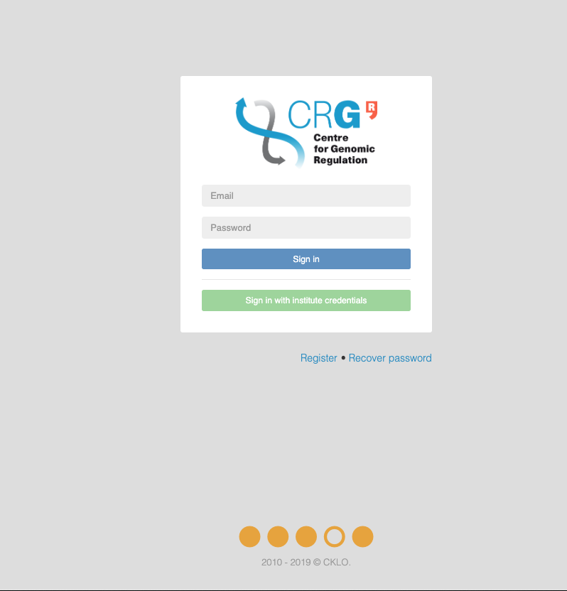
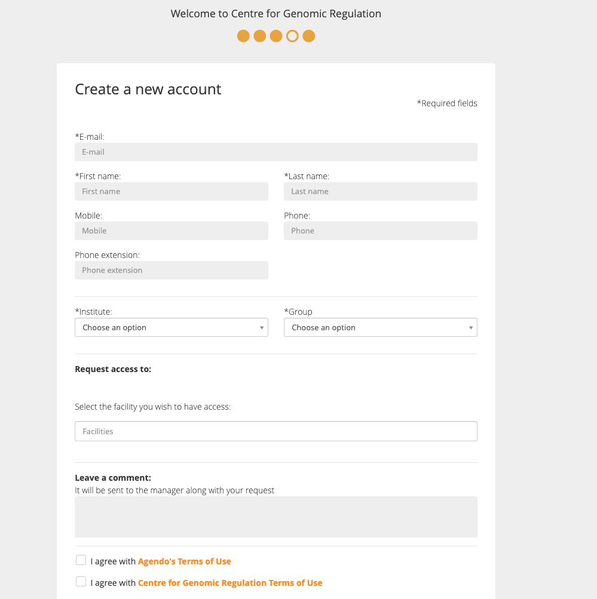
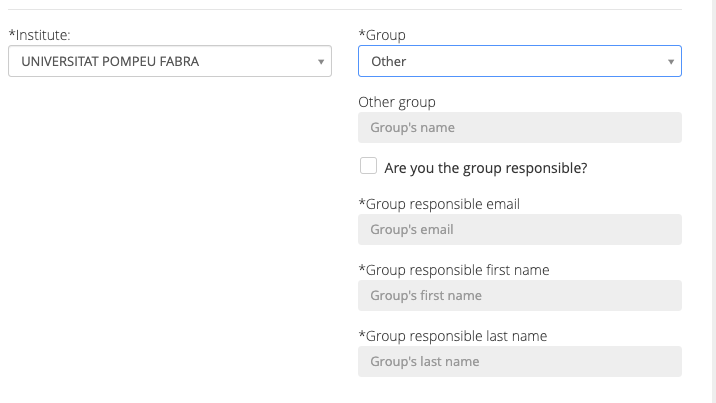
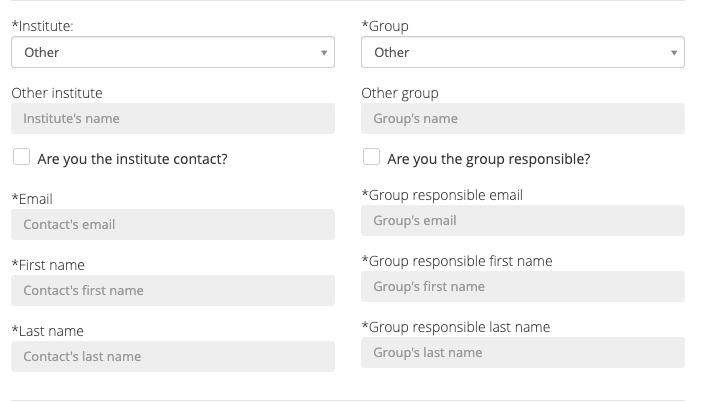
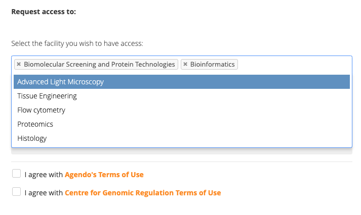

# How to submit a request to the core facilities.

In case you are new user you can register at [https://crg.agendo.science](https://crg.agendo.science/).

You will be prompted to a registration form where you request to access to the services of one or more facilities.

When choosing a istitution you can search your one within the list. Then you can choose the group. 

In case is either the intitution or the group are not shown you can select **other**. In this way more information are requested to be filled for entering to the system.

Here as an example we show a missing group in a the Universitat Pompeu Fabra:

and here a new research centre:

Then you can select the facility just clicking on the empty space and selecting one or more facilities.

