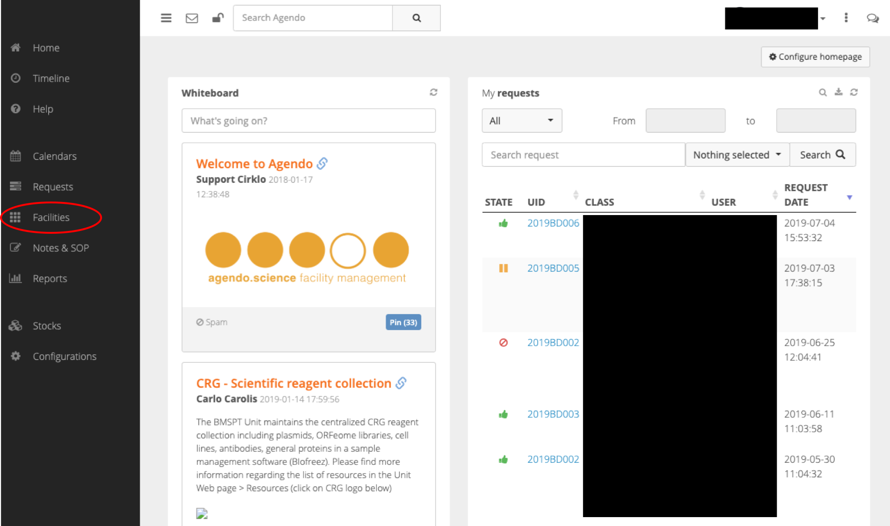
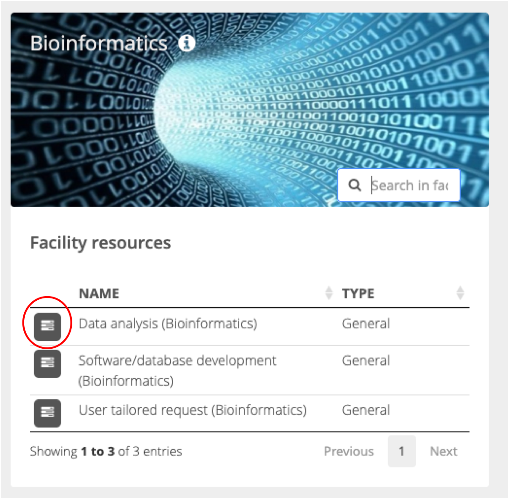

# How to submit a request to the core facilities.

In case you are new user you can register at [https://crg.agendo.science](https://crg.agendo.science/).

You will be prompted to a registration form where you request to access to the services of one or more facilities.

When choosing a istitution you can search your one within the list. Then you can choose the group. 

In case is either the intitution or the group are not shown you can select **other**. In this way more information are requested to be filled for entering to the system.

Here as an example we show a missing group in a the Universitat Pompeu Fabra:

and here a new research centre:

Then you can select the facility just clicking on the empty space and selecting one or more facilities.

Finally you have to select to agree with the Terms of Use and optionally to leave a comment for the manager.

Once the procedure is finished the request will be evaluted by a manager that will eiter accept or refuse the request. 

In case of acceptance you will receive a mail and you will be able to log in to the system with your credentials (e-mail and password).

When you log in you can reach the facilites by cliking to the corresponding button.

And then selecting the facility of interest:

Then clicking on the search box of the corresponding facility will show the available services. You can then click on the one of interest for making the proper request.

Finally you can fill the form with all the information needed for the request. You may want to indicate if your request is done on the behalf of another user (the box will be active when clickin on **Submit request on behalf of another user**).

Clicking on **Submit** will send the information to the Unit that will evaluate your request and decide wether to accept or ask for more information. 

