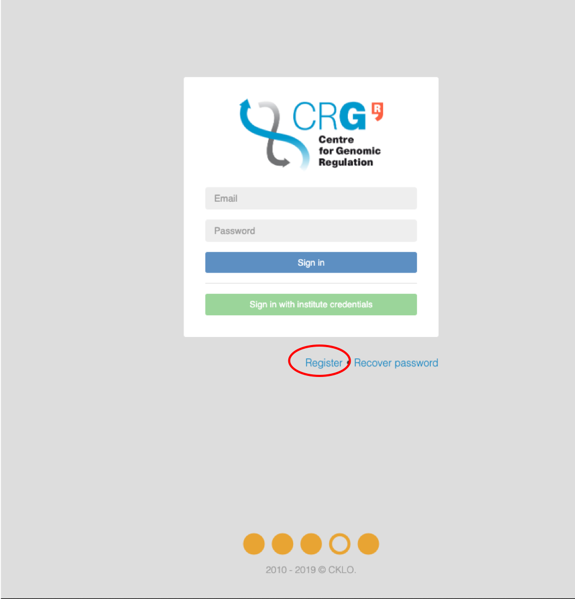
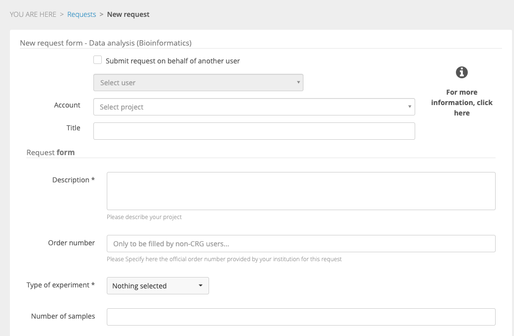

If you are a new Agendo user, register at [https://crg.agendo.science](https://crg.agendo.science/).

 

You will be prompted to a registration form.
First, fill in your credentials.
Then, select your istitute from the list and the group (laboratory). 

 hey

If your institute or group are not in the lists, select **Other**. 

 

Below is the form to register a new institute.

 
And the form to register a new group from the selected institute, for example, the Universitat Pompeu Fabra.

 

Upon registration, you can request to access the services provided by one or more facilities, by clicking on the empty text box and selecting one or more facilities.

Please review the Terms of Use, agree with them and click **"Submit"**. You can also leave a comment for the manager.

 
You will recieve an e-mail from CRG about activation of your account.
 

Once your account is active, you can login to Agendo and access **"Facilities"**.

 

 
To see the list of available services for a specific facility, for example, "Bioinformatics", click on the **"Search in facility"** white box on the right bottom of the facility image and select the service, for example, "Data Analysis". 

 
Fill the request form and click **"Submit"**. You can submit a request on behalf of another user.

